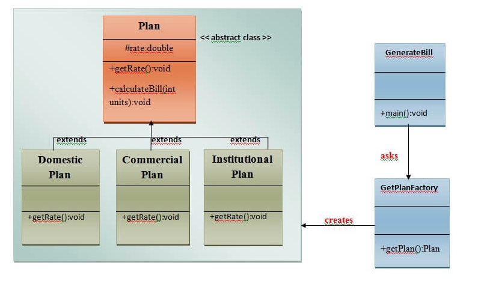
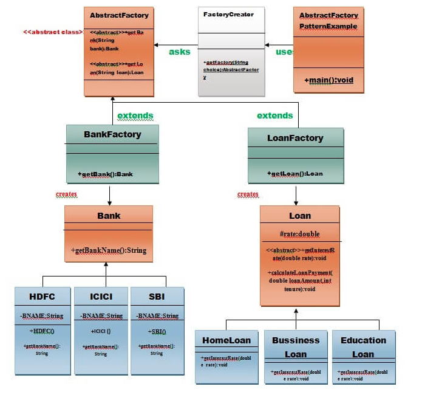

# Java-Design-Patterns
# Design Patterns

## What Is Design Pattern

A design patterns are well-proved solution for solving the specific problem/task.

------------

  
Click to expand!

**Problem Given:**
Suppose you want to create a class for which only a single instance (or object) should be created and that single object can be used by all other classes.

**Solution:**
Singleton design pattern is the best solution of above specific problem. So, every design pattern has some specification or set of rules for solving the problems. What are those specifications, you will see later in the types of design patterns.

Design patterns are programming language independent strategies for solving the common object-oriented design problems. That means, a design pattern represents an idea, not a particular implementation.

**Advantage of design pattern:**
1. They are reusable in multiple projects.
2. They provide the solutions that help to define the system architecture.
3. They capture the software engineering experiences.
4. They provide transparency to the design of an application.
5. They are well-proved and testified solutions since they have been built upon the knowledge and experience of expert software developers.
6. Design patterns don?t guarantee an absolute solution to a problem. They provide clarity to the system architecture and the possibility of building a better system.

**When should we use the design patterns?**
We must use the design patterns during the analysis and requirement phase of SDLC(Software Development Life Cycle).
Design patterns ease the analysis and requirement phase of SDLC by providing information based on prior hands-on experiences.

### 1.Creational Design Pattern
1. Factory Pattern
2. Abstract Factory Pattern
3. Singleton Pattern
4. Prototype Pattern
5. Builder Pattern.

### 2. Structural Design Pattern
1. Adapter Pattern
2. Bridge Pattern
3. Composite Pattern
4. Decorator Pattern
5. Facade Pattern
6. Flyweight Pattern
7. Proxy Pattern

### 3. Behavioral Design Pattern
1. Chain Of Responsibility Pattern
2. Command Pattern
3. Interpreter Pattern
4. Iterator Pattern
5. Mediator Pattern
6. Memento Pattern
7. Observer Pattern
8. State Pattern
9. Strategy Pattern
10. Template Pattern
11. Visitor Pattern

---------------

## Creational design patterns
Creational Design Patterns Are Concerned With The Way Of Creating Objects. These Design Patterns Are Used When A Decision Must Be Made At The Time Of Instantiation Of A Class (I.E. Creating An Object Of A Class).

---------------

#### 1. Factory Method Pattern

  
Click to expand!

A Factory Pattern or Factory Method Pattern says that just define an interface or abstract class for creating an object but let the subclasses decide which class to instantiate. In other words, subclasses are responsible to create the instance of the class.

The Factory Method Pattern is also known as Virtual Constructor.

**Advantage of Factory Design Pattern
**
- Factory Method Pattern allows the sub-classes to choose the type of objects to create.
- It promotes the loose-coupling by eliminating the need to bind application-specific classes into the code. That means the code interacts solely with the resultant interface or abstract class, so that it will work with any classes that implement that interface or that extends that abstract class.

**Usage of Factory Design Pattern**
- When a class doesn't know what sub-classes will be required to create
- When a class wants that its sub-classes specify the objects to be created.
- When the parent classes choose the creation of objects to its sub-classes.

**UML for Factory Method Pattern**
- We are going to create a Plan abstract class and concrete classes that extends the Plan abstract class. A factory class GetPlanFactory is defined as a next step.
- GenerateBill class will use GetPlanFactory to get a Plan object. It will pass information (DOMESTICPLAN / COMMERCIALPLAN / INSTITUTIONALPLAN) to GetPalnFactory to get the type of object it needs.

  
 

 
------------

#### 2.Abstract Factory Pattern

  
Click to expand!

  Abstract Factory Pattern says that just define an interface or abstract class for creating families of related (or dependent) objects but without specifying their concrete sub-classes.That means Abstract Factory lets a class returns a factory of classes. So, this is the reason that Abstract Factory Pattern is one level higher than the Factory Pattern.

An Abstract Factory Pattern is also known as Kit.

**Advantage of Abstract Factory Pattern**
- Abstract Factory Pattern isolates the client code from concrete (implementation) classes.
- It eases the exchanging of object families.
- It promotes consistency among objects.

**Usage of Abstract Factory Pattern
**
- When the system needs to be independent of how its object are created, composed, and represented.
- When the family of related objects has to be used together, then this constraint needs to be enforced.
- When you want to provide a library of objects that does not show implementations and only reveals interfaces.
- When the system needs to be configured with one of a multiple family of objects.

**UML for Abstract Factory Pattern**
- We are going to create a Bank interface and a Loan abstract class as well as their sub-classes.
- Then we will create AbstractFactory class as next step.
- Then after we will create concrete classes, BankFactory, and LoanFactory that will extends AbstractFactory class
- After that, AbstractFactoryPatternExample class uses the FactoryCreator to get an object of AbstractFactory class.

------------

